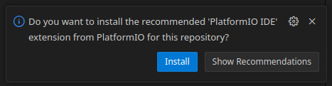

<p align="center">

</p>


# Kabot ESP32-S3 firmware repository

<p align="center">

</p>

## What is this repo?

This is a scratchpad repo of new release of [Kabot](https://github.com/kabot-io/POC) firmware for ESP32-S3 board. Key features:
- as simple setup as possible - [just VSCode with Dev Containers](https://code.visualstudio.com/docs/devcontainers/containers) plugin
- cross platform - Linux, and hopefully Windows and other *nix systems (other than linux untested)
- ease of development - built using [PlatformIO](https://platformio.org/)

## Running:

Follow those steps to set up development environment:

1. [Install VSCode](https://code.visualstudio.com/) and [Docker](https://www.docker.com/) - we'll be using [Dev Containers](https://code.visualstudio.com/docs/devcontainers/containers) plugin, so follow instructions there.

2. Clone the repository: 
```bash
git clone https://github.com/kabot-io/kabot-s3-firmware.git
```
3. Open workspace in VSCode:
```bash
code ./kabot-s3-firmware/kabot-s3.code-workspace
```
4. **When asked if you want to install PlatformIO plugin say no** - we want it installed in the container, not on the host:



However **say yes to opening workspace in Dev Container.**:


6. When VSCode restarts in the Dev Container, then install recommended plugins - i.e. PlatformIO:


7. Type `F1` -> `PlatformIO: Build` or `Ctrl + Alt + B` - first build may take a while - PlatformIO needs to download all its dependancies; toolchain, libraries, tools etc.


8. Connect Kabot to USB using USB-C cable, it should show in the USB devices; on linux you can use `lsusb | grep Espressif` to make sure that the board is detected:

```bash
lsusb | grep Espressif
```
```bash
Bus 003 Device 015: ID 303a:1001 Espressif USB JTAG/serial debug unit
```

9. Type `F1` -> `PlatformIO: Upload` or `Ctrl + Alt + U` to upload firmware to board.


10. You are all set! Happy tinkering. You may start by looking into [micro-ROS documentation](https://micro.ros.org/).